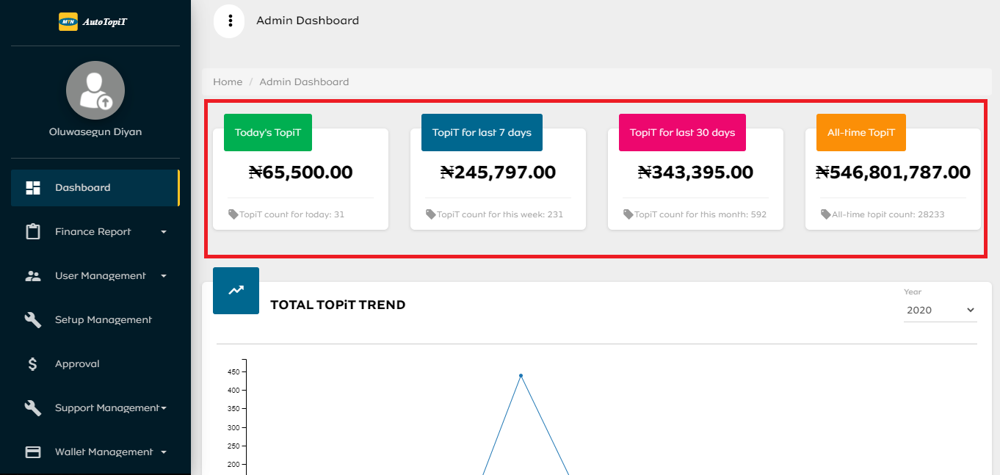
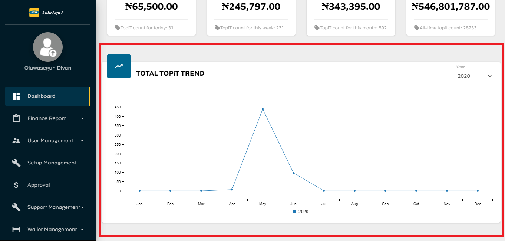

# Dashboard

The admin dashboard has statistics of the user’s activities on AutoTopiT. The dashboard is divided into 2 categories.

## TopiT Counts

This category has the following statistics:

- Today’s TopiT: This is the total count of recharge purchased for the day (as at when the dashboard was loaded).
- TopiT for last 7 days: This is a total count of recharge purchased in the last 7 days. 
- TopiT for last 30 days: This is a total count of recharge purchased in the last 30 days. 
- All-Time TopiT: This is the all-time recharge count.

## TopiT Trend

This category shows a chart of Total TopiT Trend. The chart can be rendered in Year, to achieve this the admin is to select the year from the filter dropdown.

