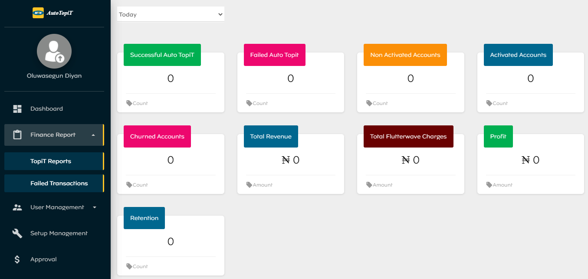
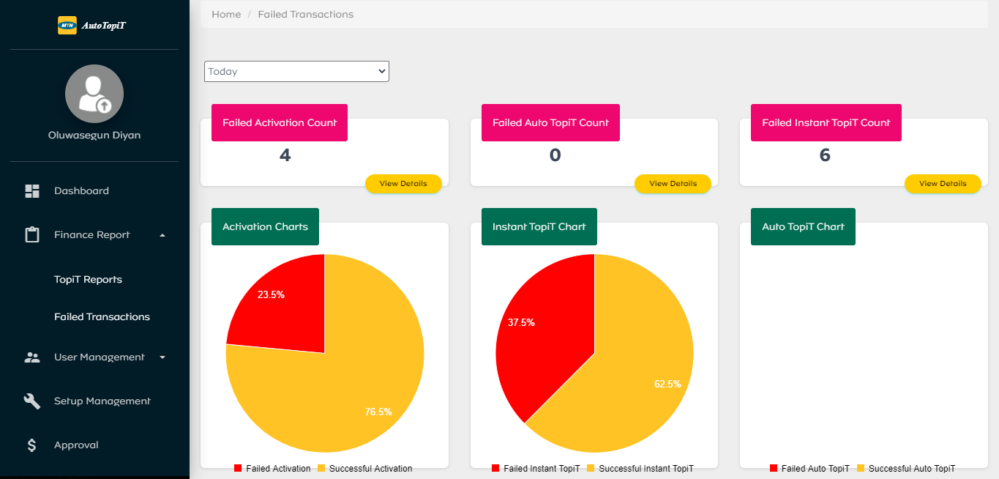
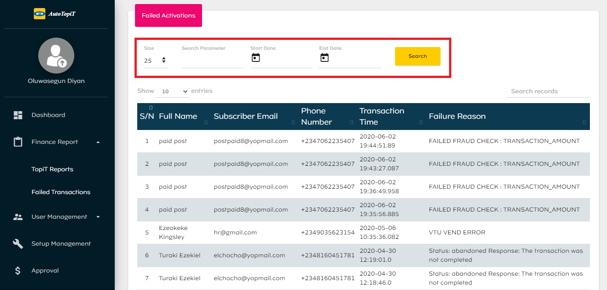

# Finance Report Module

The finance report module contains 2 categories.

## TopiT Reports
This category has the following statistics:
  - Successful Auto TopiT count
  - Non-Activated Accounts count
  - Failed Auto TopiT count
  - Activated Accounts count
  - Churned Accounts count
  - Total Revenue in amount
  - Total Flutterwave charges in amount
  - Profit in amount
  - Retention count

These reports can be rendered by day, past 7-days, past 30-days and year. To achieve this, the admin is to select from the filter dropdown.

## Failed Transactions

This section provides charts and reports about failed transactions, prevalent failed reasons and prevalent debit reasons. The reports and statistics in this category can be rendered by day, last 7-days, last 30-days, last 90-days, and year.

Admins can also click on view more details to get reports for failed transactions. These reports can be rendered by date or specific search parameter. To achieve this, the admin is to do the following:
  - Enter Search Parameter
  - Select Start Date and End Date from the date picker
  - Click on the Search button.

