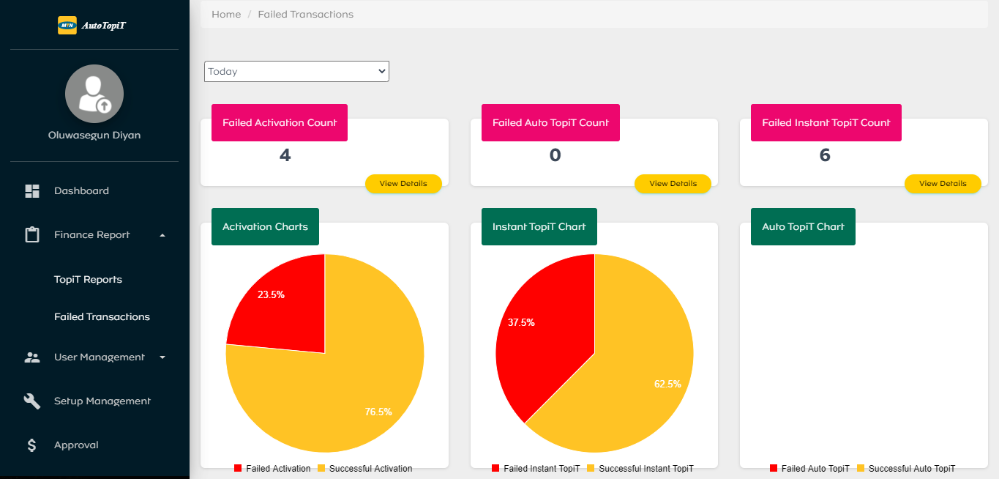
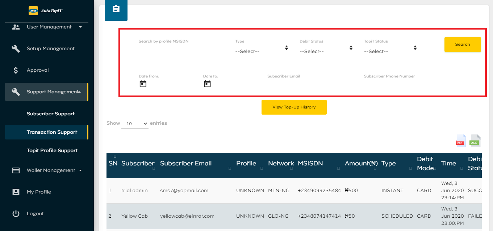
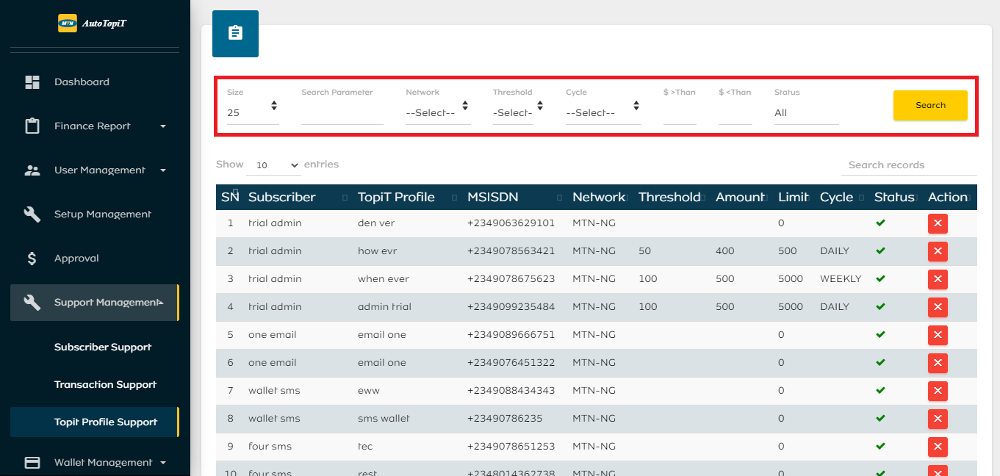
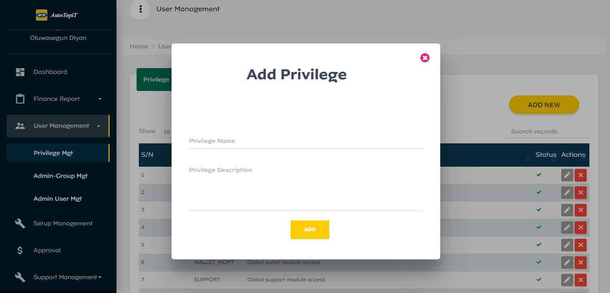
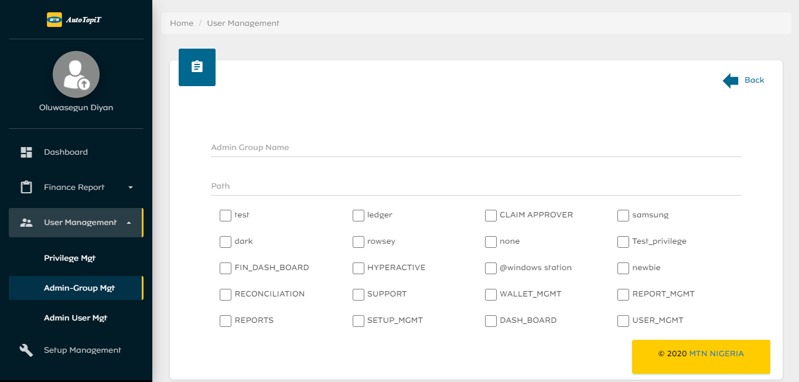
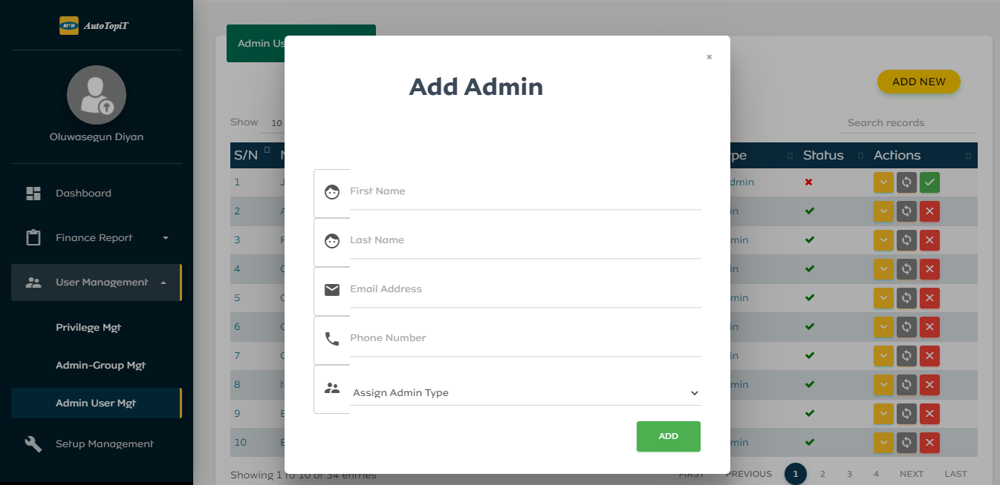
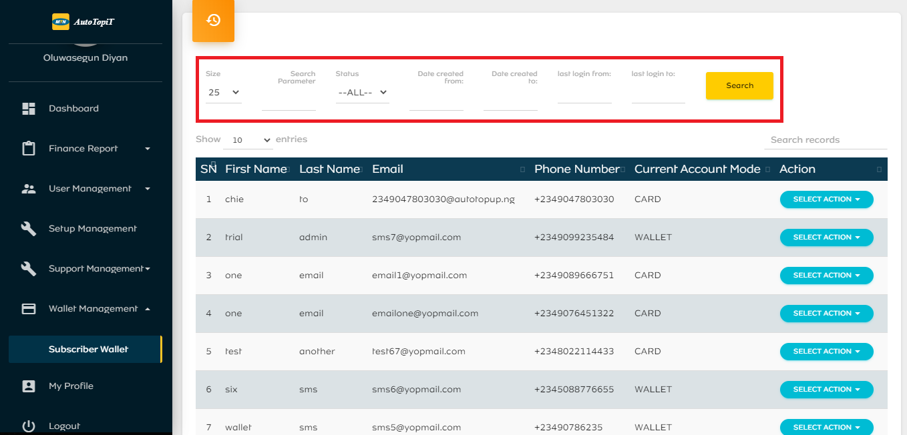

# Admin User Guide

## Introduction
AutoTopiT provides subscribers with automated airtime and data recharge. It has 3 distinct features; Auto TopiT, Instant TopiT, and Schedule TopiT. It caters for both prepaid and postpaid subscribers. Users can also set up family and friends as beneficiaries for automated recharge.

This User Guide explains the functionalities of the MTN AutoTopiT Admin Portal, the actions available, how to set up admin user roles and the privileges they can access.

## Getting Started

AutoTopiT admins have access to an admin portal where based on their privilege they can access different modules. This portal is accessed through any web browser, on launching the web browser, the admin user should navigate to AutoTopiT Admin URL (insert URL here).

### Sign In 
The pre-requisite for an admin to sign in to AutoTopiT admin portal is that an account must have been created for the admin by a super admin. The created admin account has access to modules that his/her role and privilege allows.

## Dashboard

The admin dashboard has statistics of the user’s activities on AutoTopiT. The dashboard is divided into 2 categories.

### TopiT Counts

This category has the following statistics:

- Today’s TopiT: This is the total count of recharge purchased for the day (as at when the dashboard was loaded).
- TopiT for last 7 days: This is a total count of recharge purchased in the last 7 days. 
- TopiT for last 30 days: This is a total count of recharge purchased in the last 30 days. 
- All-Time TopiT: This is the all-time recharge count.

### TopiT Trend

This category shows a chart of Total TopiT Trend. The chart can be rendered in Year, to achieve this the admin is to select the year from the filter dropdown.

## Finance Report Module

The finance report module contains 2 categories.

### TopiT Reports
This category has the following statistics:
  - Successful Auto TopiT count
  - Non-Activated Accounts count
  - Failed Auto TopiT count
  - Activated Accounts count
  - Churned Accounts count
  - Total Revenue in amount
  - Total Flutterwave charges in amount
  - Profit in amount
  - Retention count

These reports can be rendered by day, past 7-days, past 30-days and year. To achieve this, the admin is to select from the filter dropdown.

### Failed Transactions

This section provides charts and reports about failed transactions, prevalent failed reasons and prevalent debit reasons. The reports and statistics in this category can be rendered by day, last 7-days, last 30-days, last 90-days, and year.

Admins can also click on view more details to get reports for failed transactions. These reports can be rendered by date or specific search parameter. To achieve this, the admin is to do the following:
  - Enter Search Parameter
  - Select Start Date and End Date from the date picker
  - Click on the Search button.

## Setup-Management

This module contains a list of settings that can be viewed, updated, deactivated or reactivated. The list of settings is as shown in the figure below:

## Support-Management

### Subscriber Support
This module contains a log of subscribers details such as; name, email, phone number, payment mode, activation status, date created, last login and card type. Admin users can update or manually activate subscriber. Admins can filter the data based on search parameter, status (Active or Inactive), date created (start and end), last login (start and end). Subscriber support data can also be exported in an excel format.

### Transaction Support
This module contains a list of subscribers transaction details such as; name, email, phone number, amount, TopiT type and status, debit mode and status. Admins can filter the data based on:
  - Subscriber Phone Number
  - Subscriber Email
  - Type
  - Debit Status
  - TopiT Status  
  - Date From and Date to

### TopiT Profile Support
This module contains a list of subscribers TopiT profile details such as; Subscriber name, TopiT profile, phone number, threshold, amount, limit and cycle. Admins can deactivate or reactivate profiles here. Admins can filter the data based on:
  - Specific search parameter
  - Threshold
  - Cycle
  - Amount

## User Management

This module is where admin groups, admin users, and privileges are managed.

### Privilege Management
This module contains a list of all privilege names and descriptions. Admins can Update, Deactivate, or Reactivate these privileges. Admins can add New Privilege as shown in the figure below:

### Admin Group Management
This module contains a list of all admin groups, paths and the number of privileges the group could access. Admins can Update, Deactivate, or Reactivate these admin groups. Admins can also create New Admin Group using the following steps:
  - Enter Admin Group Name
  - Enter Group Path
  - Select Group Privilege. Can select as much privilege as necessary.
  - Click on Add button

### Admin User Management
This module contains a list of all admin users, email and admin type (group). Admins can Reset Password, Deactivate, or Reactivate these admin users. Admins can also add New Admin User using the following steps:
  - Enter First Name
  - Enter Last Name
  - Enter Email Address
  - Enter Phone Number
  - Assign Admin Type (Group)

## Wallet Management

### Subscriber Wallet
This module contains a log of subscriber details such as; name, email, phone number, current account mode (card or wallet). Admins can credit or debit a user’s wallet. This log can be filtered based on:
  - Specific Search Parameter
  - Status
  - Date Created (Start and End)
  - Last Login (Start and End)

