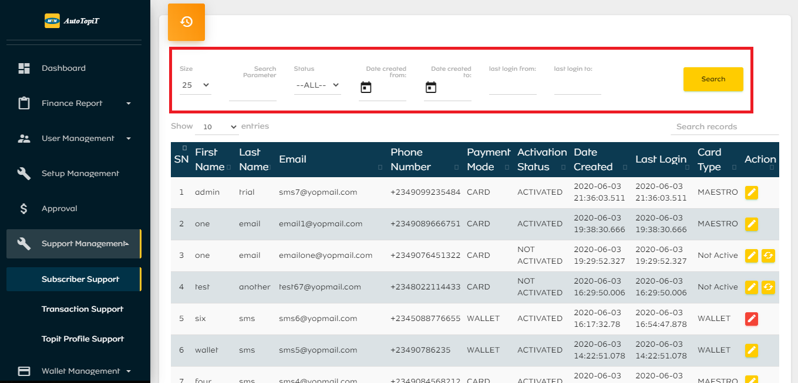
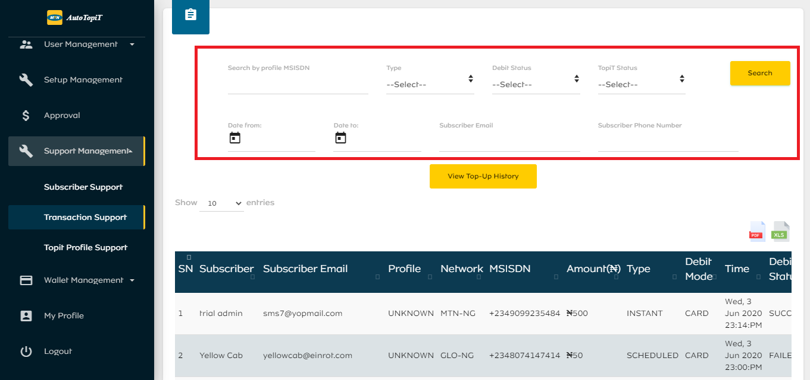
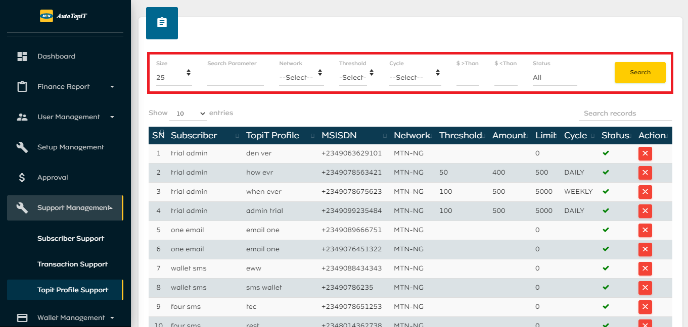

# Support-Management

## Subscriber Support
This module contains a log of subscribers details such as; name, email, phone number, payment mode, activation status, date created, last login and card type. Admin users can update or manually activate subscriber. Admins can filter the data based on search parameter, status (Active or Inactive), date created (start and end), last login (start and end). Subscriber support data can also be exported in an excel format.

## Transaction Support
This module contains a list of subscribers transaction details such as; name, email, phone number, amount, TopiT type and status, debit mode and status. Admins can filter the data based on:
  - Subscriber Phone Number
  - Subscriber Email
  - Type
  - Debit Status
  - TopiT Status  
  - Date From and Date to

## TopiT Profile Support
This module contains a list of subscribers TopiT profile details such as; Subscriber name, TopiT profile, phone number, threshold, amount, limit and cycle. Admins can deactivate or reactivate profiles here. Admins can filter the data based on:
  - Specific search parameter
  - Threshold
  - Cycle
  - Amount

