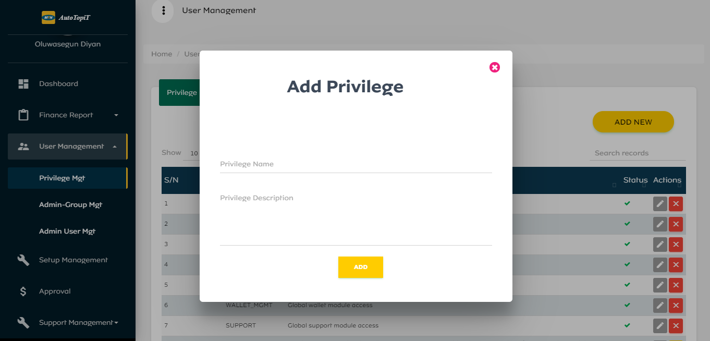
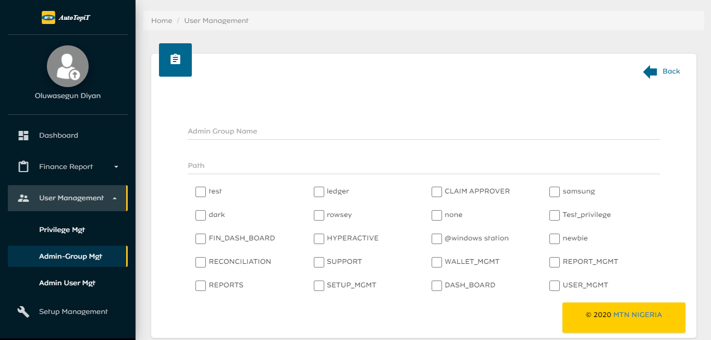
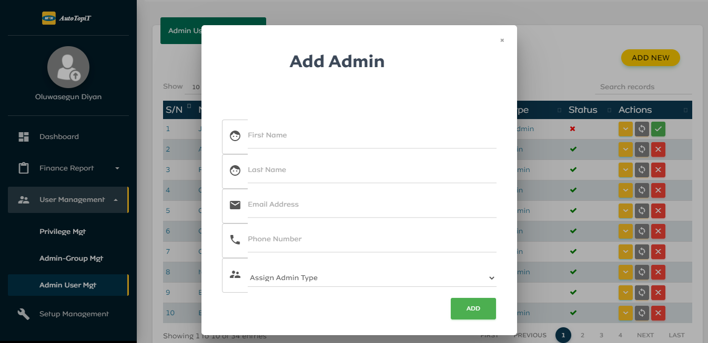

# User Management

This module is where admin groups, admin users, and privileges are managed.

## Privilege Management
This module contains a list of all privilege names and descriptions. Admins can Update, Deactivate, or Reactivate these privileges. Admins can add New Privilege as shown in the figure below:

## Admin Group Management
This module contains a list of all admin groups, paths and the number of privileges the group could access. Admins can Update, Deactivate, or Reactivate these admin groups. Admins can also create New Admin Group using the following steps:
  - Enter Admin Group Name
  - Enter Group Path
  - Select Group Privilege. Can select as much privilege as necessary.
  - Click on Add button

## Admin User Management
This module contains a list of all admin users, email and admin type (group). Admins can Reset Password, Deactivate, or Reactivate these admin users. Admins can also add New Admin User using the following steps:
  - Enter First Name
  - Enter Last Name
  - Enter Email Address
  - Enter Phone Number
  - Assign Admin Type (Group)

