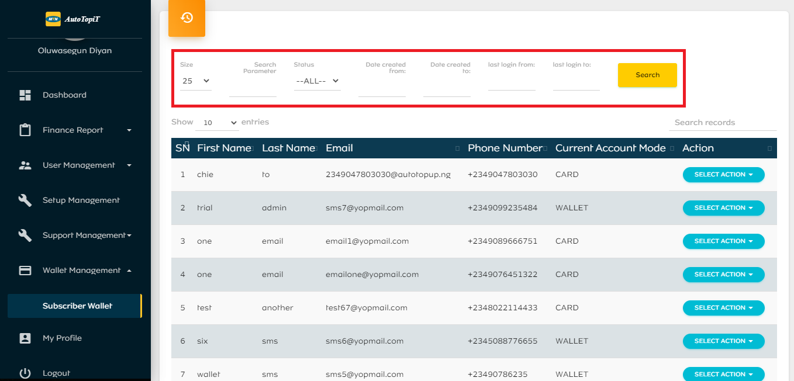

# Wallet Management

## Subscriber Wallet
This module contains a log of subscriber details such as; name, email, phone number, current account mode (card or wallet). Admins can credit or debit a user’s wallet. This log can be filtered based on:
  - Specific Search Parameter
  - Status
  - Date Created (Start and End)
  - Last Login (Start and End)

