# User Portal Guide

## Introduction

This user guide explains the functionalities of the MTN MTN Auto Tup-up application as it runs on PWA web portal.
MTN Auto Tup-up solution is an innovative product designed to provide convenience in airtime vending by automating and regulating the airtime recharge process. 

The solution allows subscribers to setup automatic airtime recharge as soon as their airtime gets below a specified threshold and terminate after a set maximum airtime has been received over an interval. The solution has other features such as Scheduling Airtime and Instant Airtime Recharge.

## Access to MTN Auto Tup-up

To access MTN MTN Auto Tup-up, the user is required to launch the application on a web browser [***insert web url***], the application supports a wide range of browser but users can get the best experience on Google Chrome and Mozilla Firefox browsers. The minimum supported versions are as follows: 
- Chrome 72 -- 29/01/2019, 
- Firefox 65 -- 29/01/2019 
- Safari(desktop) El Sierra -- 22/07/2019                                      
- Edge 44.17763 -- 13/11/2018 
- Android Chrome 71 -- 04/12/2018                                                          
- Android Firefox 65 -- 01/29/2019

## Sign Up
The Solution is designed to ensure subscribers have a very smooth and easy experience during onboarding.
To signup on MTN Auto Tup-up , the user should do the following as shown in the figure below
-	Launch the web browser
-	Navigate to web portal[***insert AT url***]
-	On the home page click on Sign Up
-	Enter all required information such as: Full Name, Phone Number (must be an MTN number), Email Address (Optional), Password
-	Select Customer Type (Postpaid or prepaid)
-	Check the Terms & Condition checkbox
-	Click on the SIGN UP button to create an account

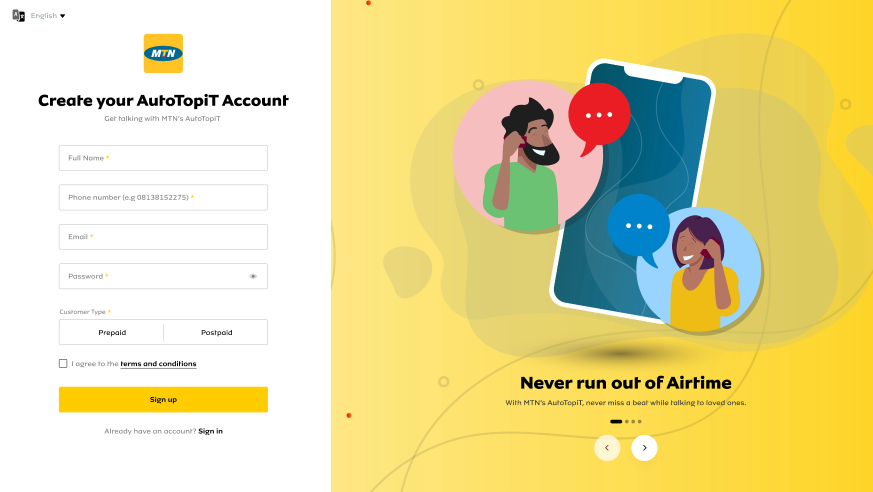

### Customer Types
The solution comes with 2 categories of subscribers in mind: Prepaid Subscribers and Postpaid Subscribers.

#### Prepaid Customer
The Prepaid Customer is one who requires constant recharge of airtime, the core value of the solution aims to automate this need for constant recharge of airtime, the customer could either opt-in to Automatic Airtime Recharge or Scheduled Airtime Recharge.

##### Prepaid Customer Sign Up Process
At Sign Up, when a customer selects Prepaid as Customer Type, a 6-digit verification code (OTP) is sent to the customer's phone number to:
1. Verify that he/she is the owner of that phone number
2. Verify that the phone number is on the MTN Network

The user enters the OTP and clicks on **Confirm OTP** to proceed. 
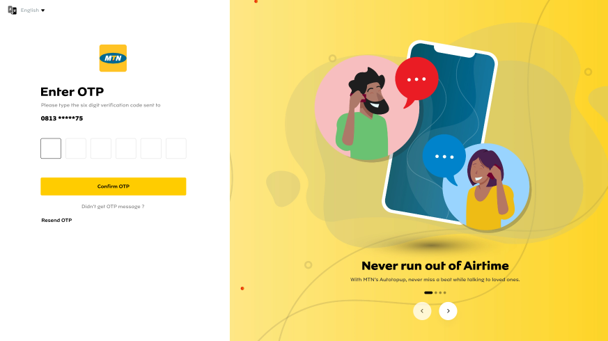

If the user enters an invalid OTP, an error message would be shown as displayed in the image below
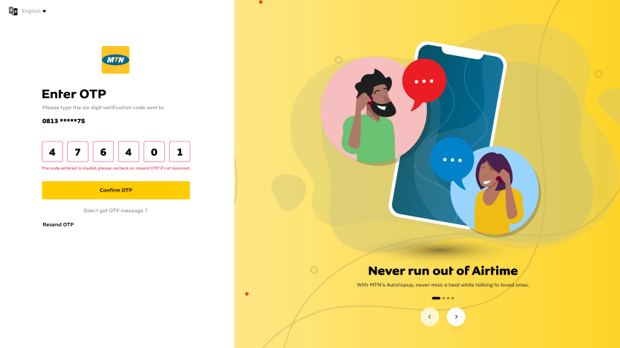

If the user is yet to receive the OTP, he/she can select **Resend OTP** 
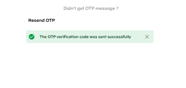

When the user has successfully verified his/her phone number, he/she is directed to a view where he/she is prompted to choose a preferred option to get started with MTN Auto Tup-up. The options are:
1. Auto Recharge
2. Schedule Recharge

These options are explained fully in their sections below.
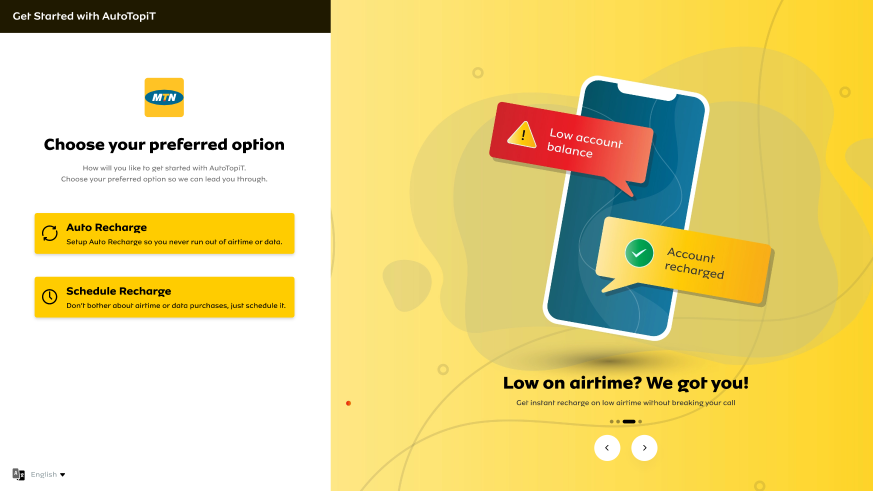

After a user has set up their preferred recharge option, they are directed to add a Payment Profile. To do this, they can either:
1. Add a Debit Card for recurring payment.
2. Fund Wallet from card or bank account.

These payment options are explained fully in their section sbelow.
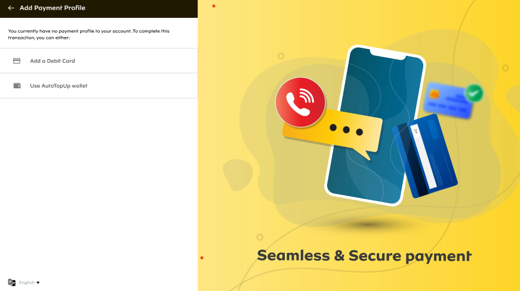

After successfully setting up payment profile, the user is activated and re-directed to the dashboard.
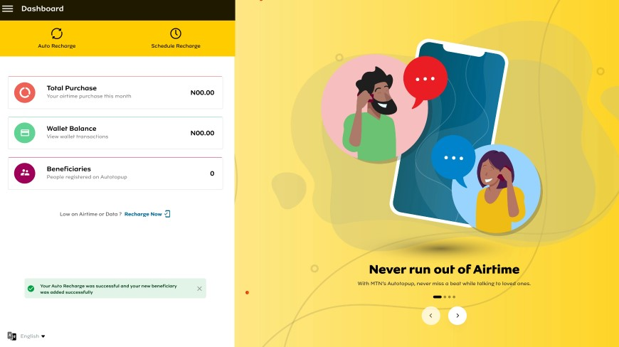

#### Postpaid Customer
The Postpaid Customer is one who is already on MTN's post-paid billing service. Postpaid customers are required to topup their Airtime with specific amount in a monthly billing cycle to enable MTN recoup the already consumed postpaid airtime.

##### Postpaid Customer Sign Up Process

At Sign Up, when a customer selects Postpaid as Customer Type, a 6-digit verification code (OTP) is sent to the customer's phone number to:
1. Verify that he/she is the owner of that phone number
2. Verify that the phone number is on the MTN Network

The User enters the OTP and clicks on **Confirm OTP** to proceed. 

If the User enters an invalid OTP, an error message would be shown as displayed in the image below

If the user is yet to receive the OTP, he/she can select **Resend OTP** 

When the user's phone number is verified, he is prompted to enter his Postpaid billing cycle for airtime recharge as follows: 
- Enter Recharge Amount
- Select a Day of the month
- Select a Time of the day

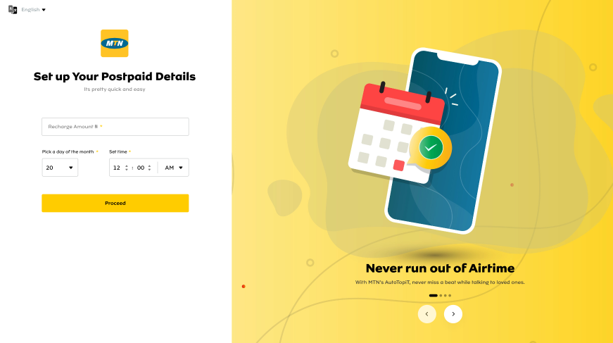

After a user has set up their postpaid details, they are directed to add a Payment Profile. To do this, they can either:
1. Add a Debit Card for recurring payment.
2. Fund Wallet from card or bank account.

These payment options are explained fully in their section below.
 

After successfully setting up payment profile, the user is activated and re-directed to the dashboard.
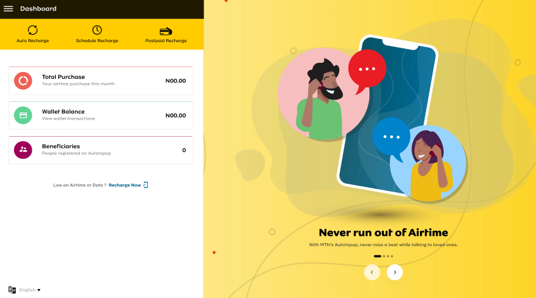

## Sign In
Existing Customers can sign in to MTN Auto Tup-up by following the steps outlined below:
- Launch the web browser
-	Navigate to web portal[***insert AT url***]
-	On the home page click on Sign In
-	Enter Phone Number or Email
-	Enter Password
-	Click on the Sign In button to proceed

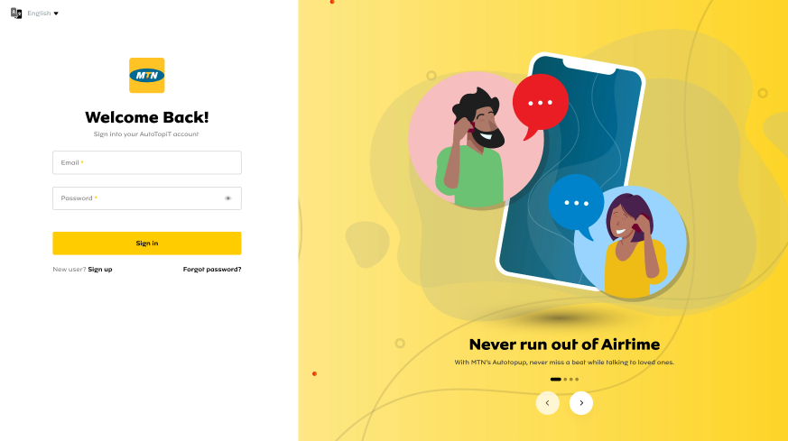

### Forgot Password
A user can request a password reset in the case of where password has been forgotten. The steps to initiate this process are outlined below:
- Click on Forgot Password on the Sign In Page
- Enter Phone Number or Email Address
- Click on Reset Password to proceed

A password link is sent the user's email/phone number. The user clicks on the link and is brought to a view where he/she can update password.

## MTN Auto Tup-up Recharge Features
### Automatic Recharge
This is the feature that allows a user set up an automatic rechagre plan so that they never run out of airtime.
To Set up Auto Recharge, the user follows these steps:
- Select Phone Number (Self, Beneficiary or Other) to recharge.
- Enter Amount: This is the specific amount to credit the user when a threshold airtime balance is reached.
- Enter Threshold: This is the minimum amount the user's account balance gets to before the system triggers an Auto Recharge.
- Enter Limit: This is the maximum amount of recharge that cannot be exceeded within a period of time.
- Enter Cycle: This is the predefined time period for the user's recharge limit. It is Daily, Weekly or Monthly.
- Click on Proceed

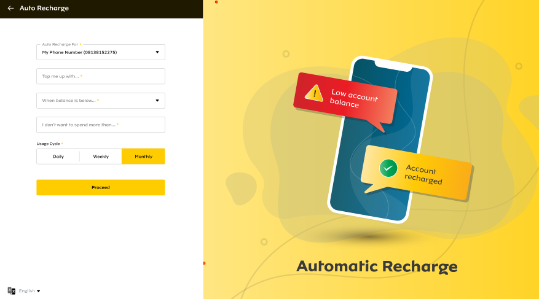

### Schedule Recharge
This feature removes the bother about airtime or data purchases and allows the user to schedule recharge for self or beneficiary. A schedule can be either single schedule or bulk schedule.

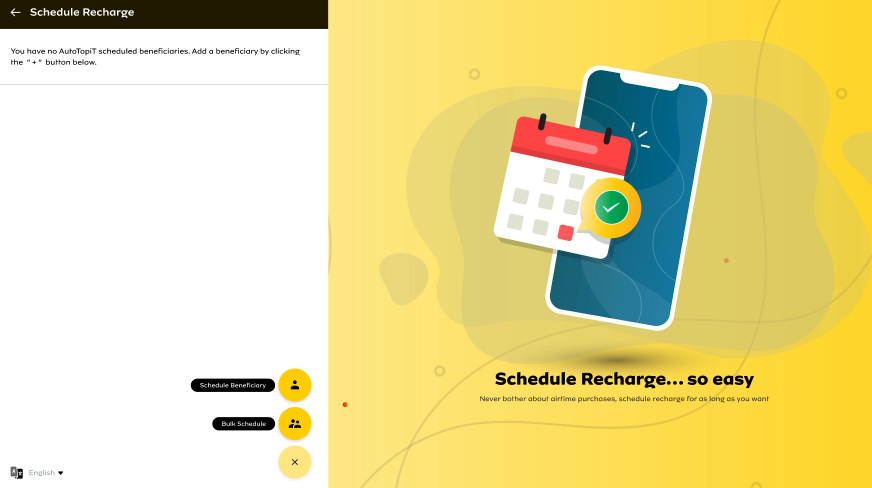

#### Schedule Beneficiary
To set up Schedule for single beneficiary, the user follows these steps:
- Select Phone Number (Self, Beneficiary or Other) to recharge.
- Select Airtime or Data recharge
- Enter Airtime Amount/Select Data Plan
- Set Frequency: One-off, Daily, Weekly, Monthly
- Choose Time, Day of the week/month
- Click on Proceed

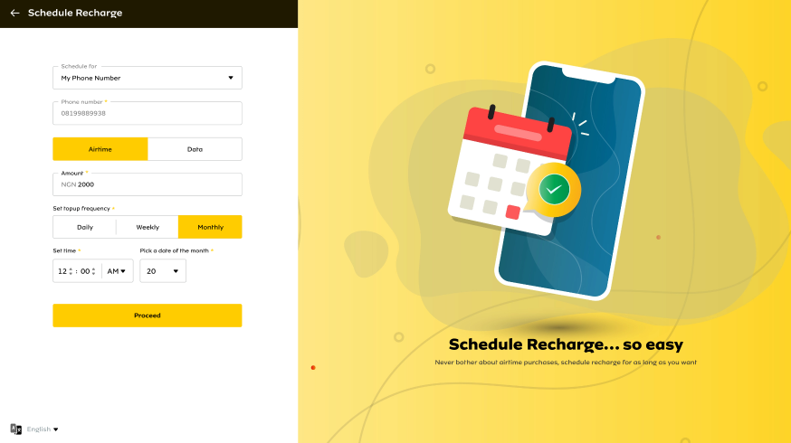

#### Bulk Beneficiary
To set up Bulk Schedule, the user follows these steps:
- Select Frequency: One-off, Daily, Weekly, Monthly
- Download Template
- Fill Template with Beneficiaries' details
- Upload Template

**Note:** Beneficiaries phone number must be on the MTN network.
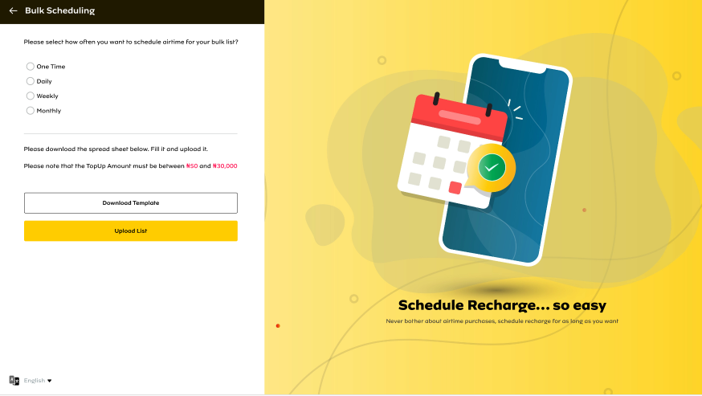

### Instant Recharge
Instant Recharge is a direct topup request to recharge your device promptly.
- Select Phone Number (Self, Beneficiary or Other) to recharge.
- Select Airtime or Data recharge
- Enter Airtime Amount/Select Data Plan
- Click on Proceed

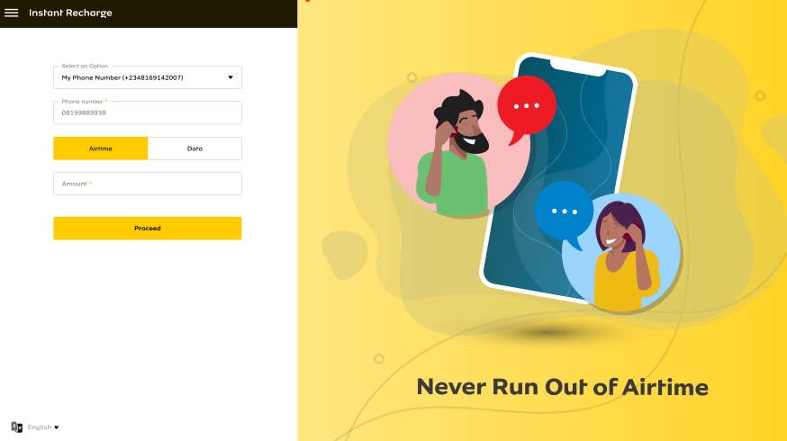

## Payment Profile
To enjoy automatic airtime recharge, the user is expected to set up a payment profile.
Users have 2 options for payment:
1. Add a Debit Card for recurring payment.
2. Fund Wallet from card or bank account.

 

### Add a Debit Card
As an option for payment, subscribers can choose to add their debit cards once and our secure payment gateway provider will automatically debit the customer's card when ever there is need to provide airtime to the customer.
The solution currently support local Nigerian debit cards provided by MasterCard, Visa & Verve.

To add a card, the user follows the steps below:
-	On the payment module click on Add a Debit Card
-	Application navigates to confirm card details

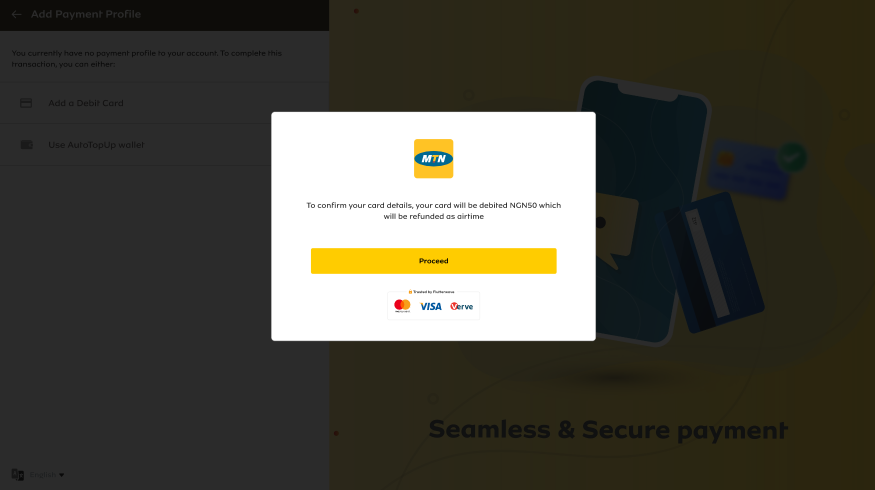 

-	The customer clicks on  proceed to confirm card
- The user is taken to our secure payment gateway where they input card details, and after payment is concluded the user is taken to their dashboard.

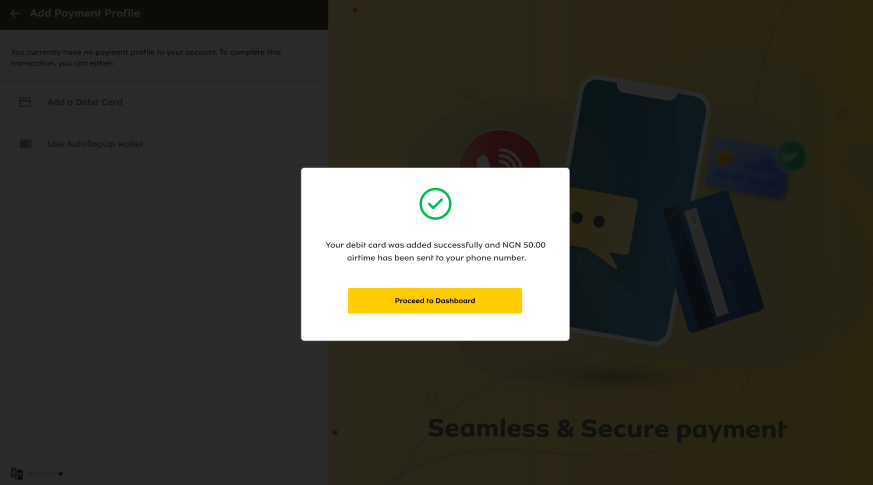

**Note** to confirm card, a debit of NGN50 will be done on the account which will be credited as airtime.

### MTN Auto Tup-up Wallet
Users can make purchase by funding their MTN Auto Tup-up Wallet, it's easy, fast and reliable. Users can fund wallet from their card or bank account.
To fund wallet, the user follows the steps below:
- On the payment module, click on Use MTN Auto Tup-up Wallet
- Enter Amount
- Click on Proceed to be directed to our secure payment gateway, where their card/bank is debited with the amount entered

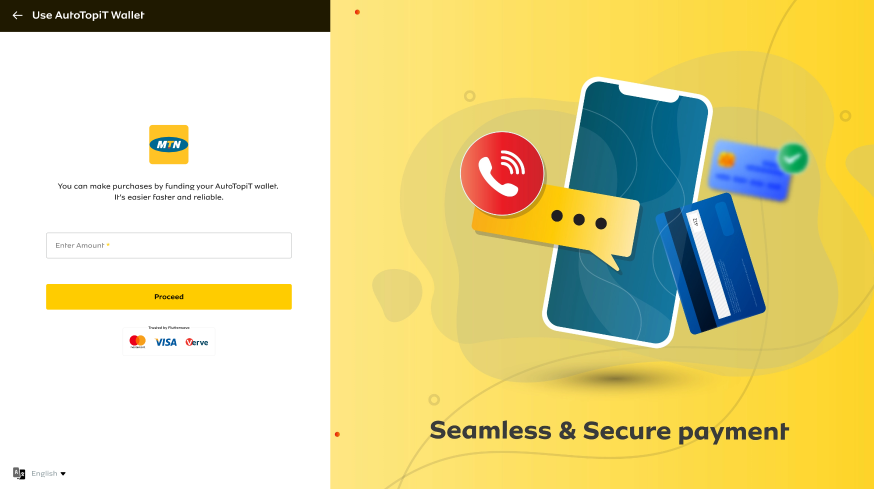 

- On successful wallet funding, the user is directed to their dashboard

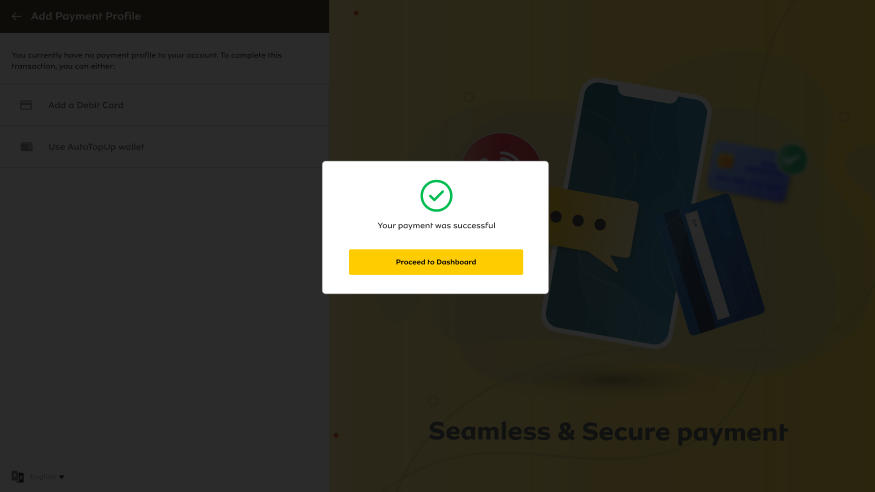

## Beneficiaries

Users can add family and friends as beneficiaries to their profiles. A beneficiary can enjoy all the features of MTN Auto Tup-up - Auto, Schedule, Instant Recharge and Postpaid Scheduling.

To set up a beneficiary, the user follows these steps below;
- Navigate Beneficiaries Module on the Menu Bar
- Click on Add Beneficiary Icon
- Enter Full Name
- Enter Phone Number (Must be on the MTN Network)
- Enter Email Address (Optional)
- Click on Create button to proceed

## Transaction History
This shows a log of all transactions made by the user. Users can filter the logs by either one of or both:
1. Transaction Type: Schedule Recharge, Instant Recharge, Auto Recharge
2. Transaction Status: Pending, Successful, Failed

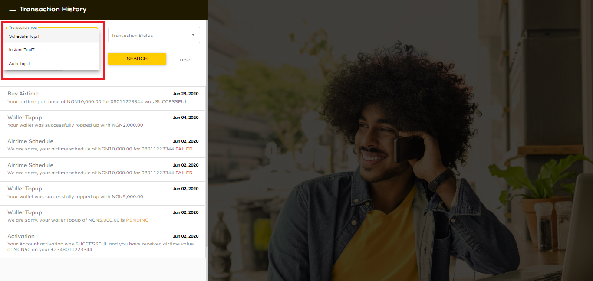
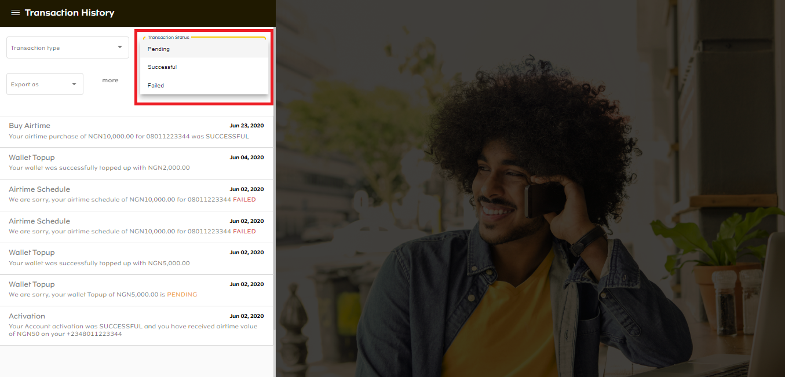

Transaction History can also be exported as either a PDF or EXCEL file.
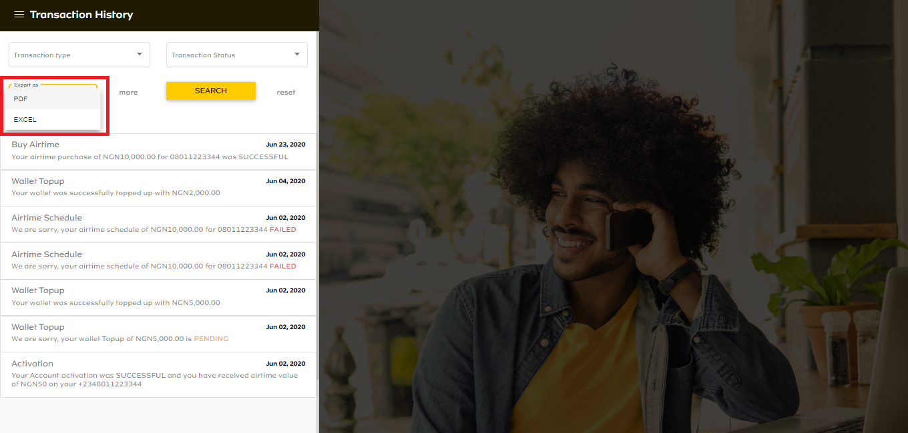

## Help & Support
We know users might have some questions so we have collated Frequently Asked Questions and provided answers. Contact details are also provided in the need that users would want to get in touch with support.

## Profile
Users can view and edit their profile details in this module. 

## Logout
Users can log out of their profile simply by clicking on the Logout option on the Menu Bar.